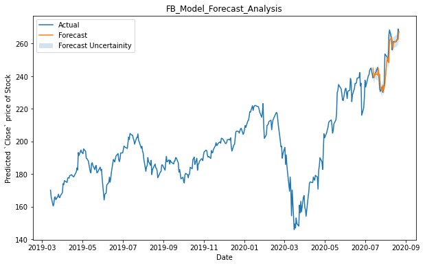
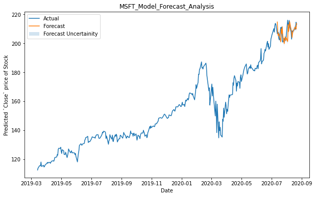
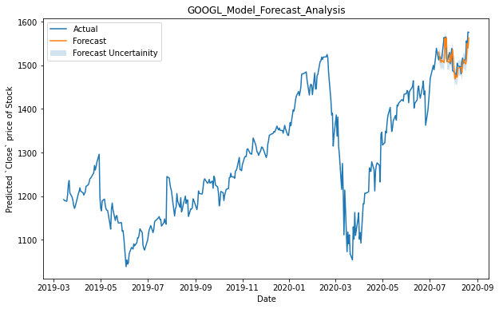

# Real Time Stock Price Prediction
[](https://www.python.org/)


Stock market prediction is the act of trying to determine the future value of a company stock or other financial instrument traded on an exchange. The successful prediction of a stock's future price could yield significant profit. The efficient-market hypothesis suggests that stock prices reflect all currently available information and any price changes that are not based on newly revealed information thus are inherently unpredictable. Others disagree and those with this viewpoint possess myriad methods and technologies which purportedly allow them to gain future price information.
Here we make use of Facebook's Time Series forcasting algorithm Prophet to predict stock market price of US based companies in real teim using multi-variate, single step forecasting strategy.


## Install Pre-requisites and Run

```
# Download/clone the project from github
$ git clone https://github.com/nityansuman/stock-price-prediction-app.git

# Create a project environment with Anaconda
$ conda create --name envname python
$ conda activate envname

# Install and set-up required packages
$ pip install -r REQUIREMENTS.txt

# Navigate to the root folder
$ cd stock-price-prediction-app/

# Run
$ python runserver.py
```

## Model Validation Analysis (30-day Validation Period)

### Facebook (Stock: FB) Validation



### Microsoft (Stock: MSFT) Validation


### Google (Stock: GOOGL) Validation


## Important Links

* [Git](https://git-scm.com/)
* [Python](https://python.org/)
* [Github](https://github.com/)
* [Flask](http://flask.pocoo.org/)
* [Web Development](https://w3schoo.com/)
* [Anaconda Python Distribution](https://conda.io)
* [Prophet](https://facebook.github.io/prophet/)
* [Time Series Forecasting](https://machinelearningmastery.com/time-series-forecasting/)
* [How to install anaconda python distribution ?](https://docs.anaconda.com/anaconda/install/)

Drop me a mail or connect with me on [Linkedin](https://linkedin.com/in/kumar-nityan-suman/) .

If you like the work I do, show your appreciation by 'FORK', 'STAR' and 'SHARE'.